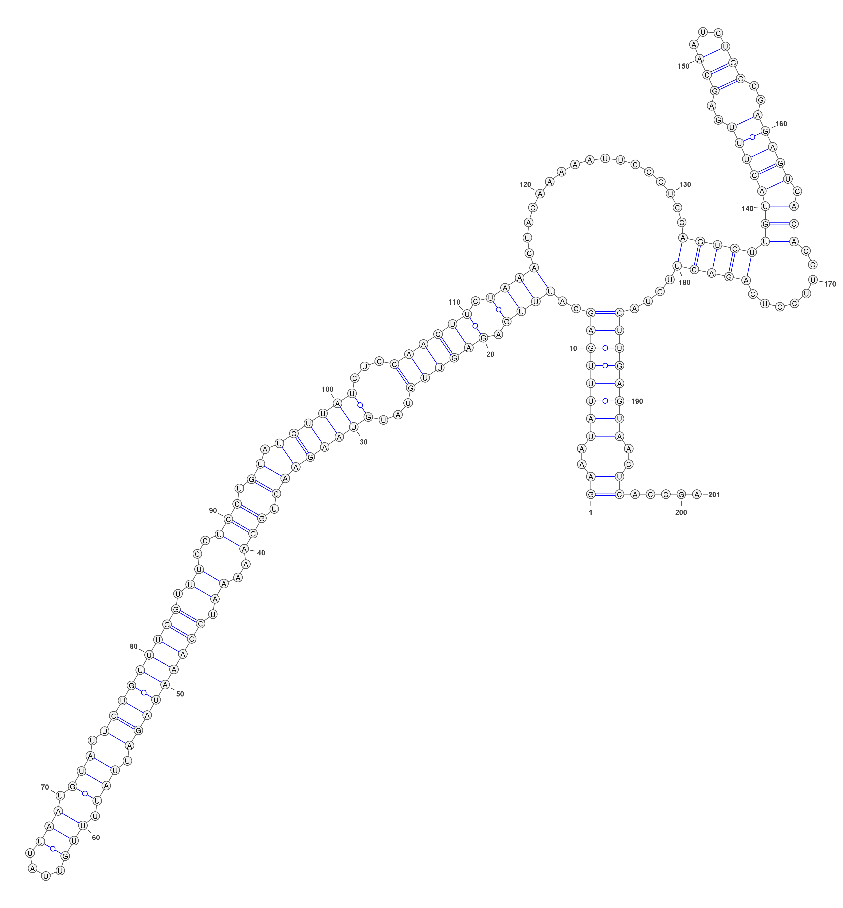

# 命令行使用VARNA可视化miRNA结构

​	[VARNA](http://varna.lri.fr/index.php?lang=en&page=command&css=varna)，非常强大的一个RNA结构可视化工具，同时支持GUI和command line 操作...

​	因为GUI版本操作起来比较慢，也不方便，故整理命令行一例如下

---

​	基本命令

```shell
java -cp VARNAvX-Y.jar fr.orsay.lri.varna.applications.VARNAcmd 
  [-i inputFile|-sequenceDBN XXX -structureDBN YYY] -o outFile [opts]
```

​	其中，各参数信息如下：

```shell
inFile: An input file using one of the supported formats (Vienna, CT, BPSeq or RNAML).
XXX: An RNA sequence. #是可以直接贴上RNAseq
YYY: A well-parenthesized expression with dots whose size matches that of the input sequence. #是可以直接贴上Structure
outFile: An output file whose format is guessed from the extension. #会依据 后缀 自动识别输出文件格式
```

​	调试命令

```shell
# 如果在windows上直接运行这个命令，那么会弹出操作界面，没啥意义
java -cp VARNAv3-93.jar fr.orsay.lri.varna.applications.VARNAcmd 
# 速度极其快，真的，秒出
java -cp VARNAv3-93.jar fr.orsay.lri.varna.applications.VARNAcmd -sequenceDBN GAAAUAUUUGAGCAUUUGAGAGUUGUAUGUAAGAACUGGAAAAAUCCAAAUAGAUUAUUUUGUUAUUAAUGUAUUCUGUUUGGUUUCCUCCUGUAUCUUAUCUCCAACUUCUAAACUACAAAAAUUCCCUCCAGUCUUGUACUUUGAGCAAUCUGCCGAGAGUCACACCUUCCUCAGACUUGUACUUGAGUAACUCACCGA -structureDBN ((..((((((((..((((.((((((...((((((((.(((..((.(((((((((.(((.(((....))).))).))))))))).))..))).)).))))))...)))))).)))).................(((((((((((((..(((...)))..))))).)))........)))))....))))))))..))..... -o default.png  -border "20x30" -resolution 10
```

​	基本结果




​	设置某个区段的颜色（**miRNA的 mature seq  和 star seq**）

```shell
# 我们知道miRNA mature对应的是79到100的bases
perl -le "print join qq{,},79..100"
79,80,81,82,83,84,85,86,87,88,89,90,91,92,93,94,95,96,97,98,99,100
# star链对应的是 30到50
perl -le "print join qq{,},30..50"
30,31,32,33,34,35,36,37,38,39,40,41,42,43,44,45,46,47,48,49,50
# 基于已知的序列 和 fold的结果，以及上面的位置，直接标记
java -cp VARNAv3-93.jar fr.orsay.lri.varna.applications.VARNAcmd -sequenceDBN GAAAUAUUUGAGCAUUUGAGAGUUGUAUGUAAGAACUGGAAAAAUCCAAAUAGAUUAUUUUGUUAUUAAUGUAUUCUGUUUGGUUUCCUCCUGUAUCUUAUCUCCAACUUCUAAACUACAAAAAUUCCCUCCAGUCUUGUACUUUGAGCAAUCUGCCGAGAGUCACACCUUCCUCAGACUUGUACUUGAGUAACUCACCGA -structureDBN ((..((((((((..((((.((((((...((((((((.(((..((.(((((((((.(((.(((....))).))).))))))))).))..))).)).))))))...)))))).)))).................(((((((((((((..(((...)))..))))).)))........)))))....))))))))..))..... -basesStyle1 "fill=#FF0000,outline=#FF0000,label=#000000,number=#FF0000" -applyBasesStyle1on "79,80,81,82,83,84,85,86,87,88,89,90,91,92,93,94,95,96,97,98,99,100" -basesStyle2 "fill=#FF6600,outline=#FF6600,label=#FFFFFF,number=#FF6600" -applyBasesStyle2on "30,31,32,33,34,35,36,37,38,39,40,41,42,43,44,45,46,47,48,49,50" -o Color.jpg -border "20x30" -resolution 10
# 可以直接得到图片，如果需要矢量图，那么修改 输出文件 后缀 为 .svg 即可
# 也可以直接
```


